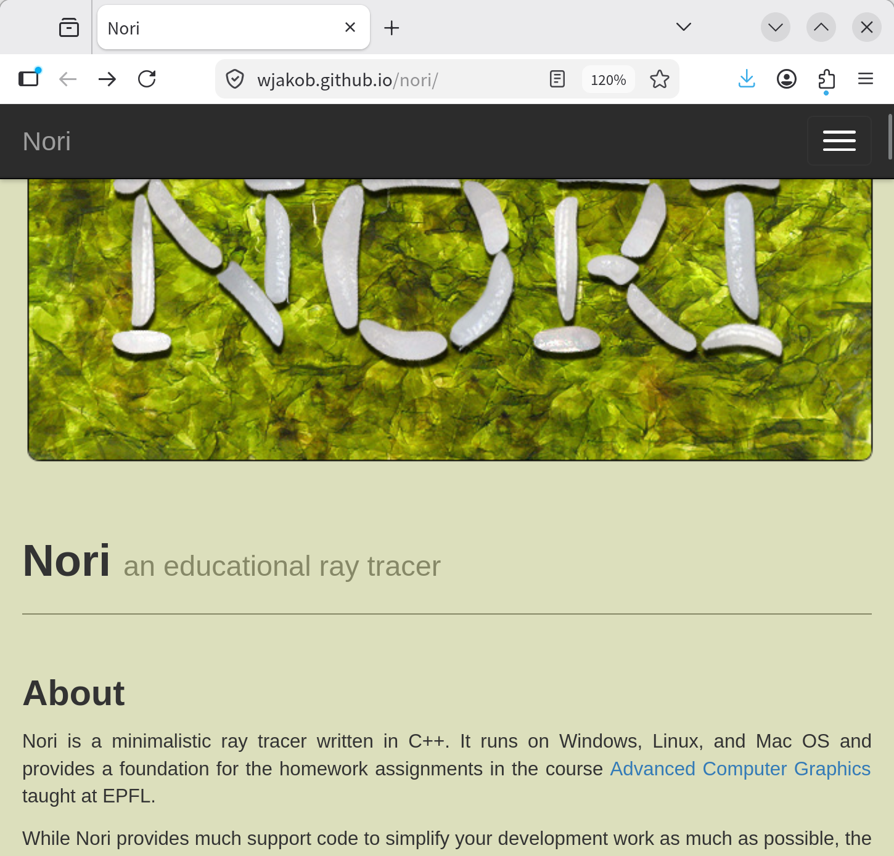
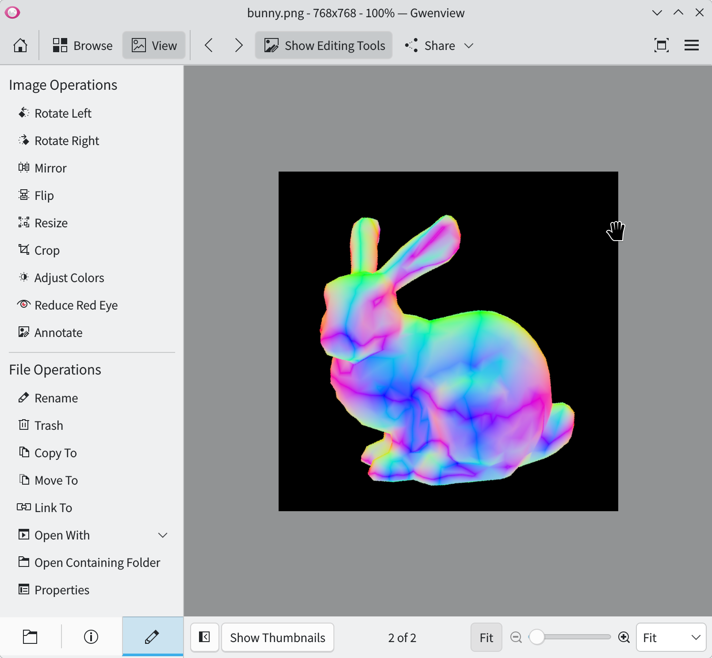

## Nori - an educational ray tracer

前幾天看到友人 @anj226 的 IG 限時動態，他發了一張看起來是 ray tracing 產生的圖。由於我一直很嚮往電腦圖學的知識，因此忍不住回覆他的限時動態進一步詢詢問。他說，這是 EPFL 的 [Nori](https://wjakob.github.io/nori/)，是一個教學用的 project。

<figure>
  
  <figcaption>Nori 的網站</figcaption>
</figure>

這讓我想起大二的寒假在 Coursera 上自學機器學習基石，以及大三旁聽作業系統時自我練習 xv6 作業。總之，希望我能複製同樣的模式自學 Nori，但實際上究竟能走多遠，我也不知道。就看這個標題能更新幾篇文章吧。

## Assignment 1: Downloading and Compiling Nori

### Compilation

第一份作業是環境準備。作業說明中提及了 Git 的使用，然後是說明怎麼編譯程式碼。

我的電腦系統使用 Arch Linux，安裝了 `cmake` 後，照著作業說明來編譯程式碼，但因為 Nori 的 dependency 有許多陳舊的 library，裡面的 cmake 檔案使用了舊的格式，因此需要手動加上 `-DCMAKE_POLICY_VERSION_MINIMUM=3.5` 的 flag 才能順利編譯。另外，`tbb` 這個 extension 因為 C++ 版本過舊，編譯時也需要加上 `-DCMAKE_CXX_FLAGS="-Wno-error=changes-meaning"` 的 flag 才能順利編譯。最終使用的 command 如下：

```bash
mkdir build && cd build
cmake -DCMAKE_POLICY_VERSION_MINIMUM=3.5 -DCMAKE_CXX_FLAGS="-Wno-error=changes-meaning" ..
make -j
```

### Create Your First Nori Class

依照作業說明，新增 `src/normals.cpp`，並貼上指定的程式碼。重新編譯後，即可得到作業要求的彩色兔子。

<figure>
  
  <figcaption>彩色兔兔！</figcaption>
</figure>

這大概是最簡單的作業吧。難以想像接下來的作業會有多難多刺激 :dizzy_face:
