## Assignment 2: Monte Carlo Sampling and Ambient Occlusion

傳送門：[https://wjakob.github.io/nori/#pa2](https://wjakob.github.io/nori/#pa2)

### Part 1: Monte Carlo Sampling

對電腦而言，產生一個 0 到 1 之間的 random number 是很常見的操作，但 computer graphics 的領域中，我們經常會需要從各種形狀中做 uniform sampling，或甚至是做 non-uniform sampling。這時我們就需要 warping function 的幫忙，把一個（或一些）random variable 轉換成另一個（或一些）我們想要的 distribution。

這個部份的作業是要寫 warping function，但是大一微積分、大二機率與統計這些必修課都已離我太遠，因此在寫這份作業時我經常透過數學的直覺與 AI 的輔助來亂搞數學符號。如果有明顯錯誤或數學上不嚴謹的地方，歡迎寫信或傳訊息與我討論。

#### `Warp::squareToUniformDisk`

這個 subtask 是要用 uniform square 來轉換成 uniform disk。也就是說，uniform random 產生 $x, y$ 兩個值，並透過 $f(x, y), g(x, y)$ 兩個函數進行 warping，所產生的值要相當於在 disk 上進行 uniform random sampling。

<figure>
  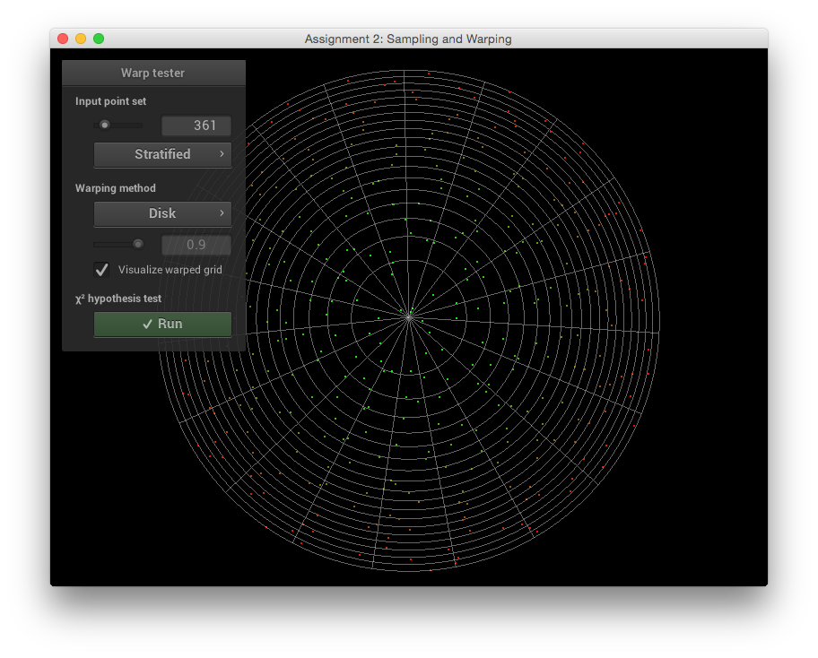
  <figcaption>作業說明中的 uniform disk 示意圖</figcaption>
</figure>

##### Source distribution

$$
\begin{gather*}
  x \leftarrow U(0, 1) \\\\
  y \leftarrow U(0, 1)
\end{gather*}
$$

PDF (Probability Density Function):

$$\frac{1}{\text{Area}} = 1$$

The infinitesimal probability (probability of selecting $(x, y)$ inside a small area element $\mathrm{d}A$) is the density multiplied by the area:

$$\text{PDF} \cdot \mathrm{d}A = 1 \cdot \mathrm{d}x\ \mathrm{d}y$$

##### Target distribution

I'll use $r$ and $\theta$ to denote the transformed random value. Since $y$ is uniformly distributed on $[0, 1]$, choosing $\theta = 2 \pi y$ makes $\theta$ uniformly distributed on $[0, 2\pi)$. Then, assume the transformation to be $r = f(x)$.

PDF:

$$\frac{1}{\text{Area}} = \frac{1}{\pi \cdot 1^2} = \frac{1}{\pi}$$

In polar coordinate, the infinitesimal area element is $\mathrm{d}A = r\ \mathrm{d}r\ \mathrm{d}\theta$. Therefore, infinitesimal probability:

$$\text{PDF} \cdot \mathrm{d}A = \frac{1}{\pi} \cdot \left( r\ \mathrm{d}r\ \mathrm{d}\theta \right)$$

##### Combine

Since the transformation should preserve probability, the infinitesimal probability before and after the transformation must be equal:

$$
\mathrm{d}x\ \mathrm{d}y = \frac{1}{\pi} \cdot r\ \mathrm{d}r\ \mathrm{d}\theta
$$

Replacing the variables,

$$
\begin{align*}
    & \mathrm{d}x\ \mathrm{d}y = \frac{1}{\pi} \cdot f(x) \cdot f^{\prime}(x)\ \mathrm{d}x\ \cdot 2\pi\ \mathrm{d}y \\\\
    \Rightarrow\ & \frac{1}{2} = f(x) \cdot f^{\prime}(x) \\\\
    \Rightarrow\ & f(x) = \sqrt{x}
\end{align*}
$$

So, we have our transformation:

$$
\begin{gather*}
  \theta = 2\pi y \\\\
  r = \sqrt{x}
\end{gather*}
$$

Finally, transform polar coordinate to cartesian coordinate:

$$
\begin{gather*}
  x' = r\ \cos{\theta} \\\\
  y' = r\ \sin{\theta}
\end{gather*}
$$

##### Write the code

值得注意的是，nori 本身並沒有地方提供我們 $\pi$ 這個常數。我搜尋了整個 repo，發現在 `ext/eigen/unsupported/doc/examples/` 有些檔案使用了 `const double pi = std::acos(-1.0);` 的寫法，就借花獻佛使用一樣的寫法。

```cpp
Point2f Warp::squareToUniformDisk(const Point2f &sample) {
    auto t = 2 * pi * sample.y();
    auto r = std::sqrt(sample.x());
    return Point2f{static_cast<float>(r * std::cos(t)), static_cast<float>(r * std::sin(t))};
}

float Warp::squareToUniformDiskPdf(const Point2f &p) {
    auto r2 = p.x() * p.x() + p.y() * p.y();
    return (r2 > 1.) ? 0 : 1 / pi;
}
```

執行 `./warptest` 的結果：

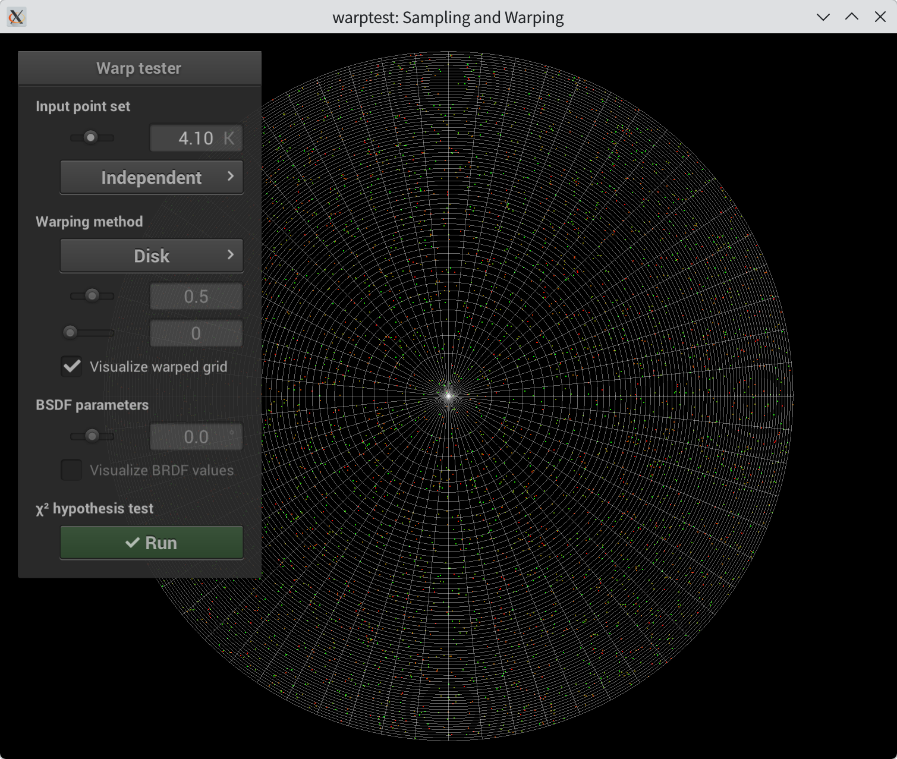
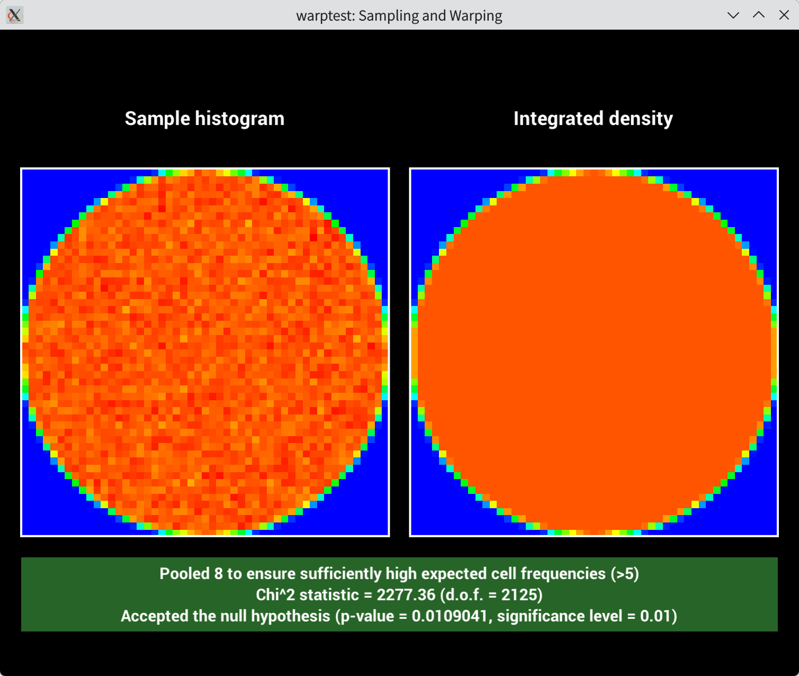

#### `Warp::squareToTent`

##### Derivation

用課程網寫的 "recipe":

1. 求出 CDF (Cumulative Distribution Function)
2. 求出 inverse CDF
3. 用 inverse CDF 當 warping function，這樣 warp 過後的分佈就會是目標分佈

Calculating CDF:

$$
\begin{align*}
\int_{-1}^{t}p_1(x)\mathrm{d}x &= \begin{cases}\int_{-1}^{t}(1-|x|)\mathrm{d}x &\text{if}\ t < 0 \\\\ \int_{-1}^{0}(1-|x|)\mathrm{d}x + \int_{0}^{t}(1-|x|)\mathrm{d}x &\text{if}\ t \ge 0\end{cases} \\\\
&= \begin{cases}\frac{1}{2}(t+1)^2 &\text{if}\ t < 0 \\\\ -\frac{1}{2}(t-1)^2+1 &\text{if}\ t \ge 0\end{cases}
\end{align*}
$$

Inverse CDF is $\begin{cases}\sqrt{2u}-1 &\text{if}\ u < \frac{1}{2} \\\\ \sqrt{-2(u-1)}+1 &\text{if}\ u \ge \frac{1}{2}\end{cases}$

##### Code

```cpp
Point2f Warp::squareToTent(const Point2f &sample) {
    auto inv_cdf = [](float u) -> float {
        return (u < 0.5) ? (std::sqrt(2 * u) - 1) : (1 - std::sqrt(-2 * (u - 1)));
    };

    return Point2f{inv_cdf(sample.x()), inv_cdf(sample.y())};
}

float Warp::squareToTentPdf(const Point2f &p) {
    auto func = [](float x) -> float {
        if (std::abs(x) > 1) return 0;
        return 1 - std::abs(x);
    };

    return func(p.x()) * func(p.y());
}
```

執行 `./warptest` 的結果：

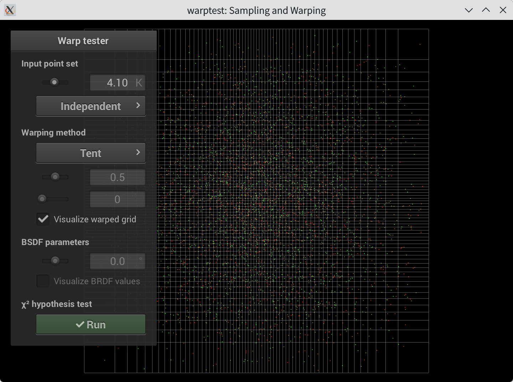
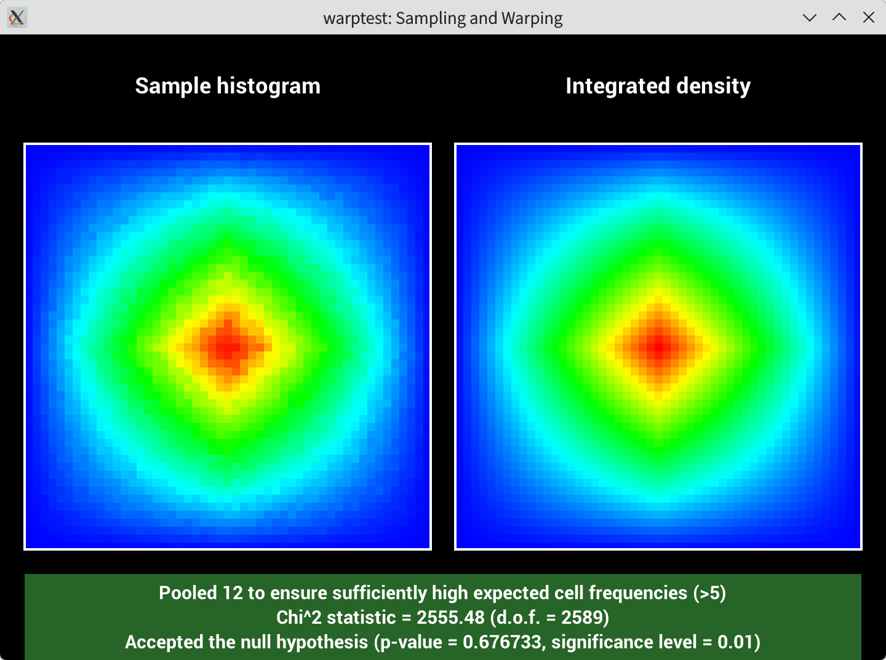

#### `Warp::squareToUniformSphere`

用跟 `squareToUniformDisk` 一樣的推導方式。

##### Derivation

We use $(r, \theta, \phi)$ to denote the polar coordinate, where $\theta$ is the angle between a point on the sphere and the north pole, and $\phi$ is the azimuthal angle of rotation around z-axis.

Since target is a uniform sphere, the PDF is $\frac{1}{4\pi}$ (since the surface area of a unit sphere is a constant $4\pi$). Additionally, an infinitesimal area of a sphere is $\sin{\theta} \cdot \mathrm{d}\theta \cdot \mathrm{d}\phi$.

Since the warping function should preserve probability, the infinitesimal probability before and after the transformation must be equal:

$$
\mathrm{d}x\ \mathrm{d}y = \frac{1}{4\pi} \cdot \sin{\theta} \cdot \mathrm{d}\theta \cdot \mathrm{d}\phi
$$

Since $\phi$ and $\theta$ are independent, the warping function can also be independent. Let $\phi = 2\pi y$ and $\theta = f(x)$.

Replacing the variables:

$$
\begin{align*}
& \mathrm{d}x\ \mathrm{d}y = \frac{1}{4\pi} \cdot \sin{f(x)} \cdot f^\prime(x) \cdot \mathrm{d}x \cdot 2\pi \cdot \mathrm{d}y \\\\
\Rightarrow & 2 = \sin{f(x)} \cdot f^\prime(x) \\\\
\Rightarrow & f(x) = \cos^{-1}(-2x+C)
\end{align*}
$$

By mapping $x = 0$ to $\theta = 0$, we can obtain $C = 1$.

So, the warping function is:

$$
\begin{gather*}
\theta = \cos^{-1}(-2x+1) \\\\
\phi = 2\pi y
\end{gather*}
$$

And we can map the polar coordinate to cartesian coordinate using

$$
\begin{cases}
x = \sin\theta \cos\phi \\\\
y = \sin\theta \sin\phi \\\\
z = \cos\theta
\end{cases}
$$

##### Code

根據上面推導出的公式，最直覺的程式應該是先用 `std::acos` (cosine 的反函數) 算出 $\theta$，然後再用極座標轉直角座標的公式去算座標值。

```cpp
Vector3f Warp::squareToUniformSphere(const Point2f &sample) {
    auto phi = 2 * pi * sample.y();
    auto theta = std::acos(-2 * sample.x() + 1);
    return Vector3f{
        static_cast<float>(std::sin(theta) * std::cos(phi)),
        static_cast<float>(std::sin(theta) * std::sin(phi)),
        static_cast<float>(std::cos(theta))
    };
}
```

然而，其實有更好的寫法可以避免昂貴的 `std::acos`。可以觀察到，我們其實不是直接使用 $\theta$ 的值，而是使用 $\sin\theta$ 和 $\cos\theta$. 這些其實都可以用直角座標來求得，例如 $z$ 的值其實就剛剛好是 $\cos\theta$，而 $\sin\theta$ 則可以用畢氏定理來得到。

因此，我們可以將程式碼寫成下面這樣：

```cpp
Vector3f Warp::squareToUniformSphere(const Point2f &sample) {
    float z = -2.f * sample.x() + 1;
    float sin_theta = std::sqrt(std::max(0.f, 1.f - z * z));
    float phi = 2 * pi * sample.y();
    return Vector3f{
        sin_theta * std::cos(phi),
        sin_theta * std::sin(phi),
        z
    };
}

float Warp::squareToUniformSpherePdf(const Vector3f &v) {
    // constexpr auto eps = 1e-8; // too strict, will not pass X^2 test
    constexpr auto eps = 1e-6;
    auto r2 = v.x() * v.x() + v.y() * v.y() + v.z() * v.z();
    return (std::abs(r2 - 1.) < eps) ? 1 / (4 * pi) : 0;
}
```

執行 `./warptest` 的結果：

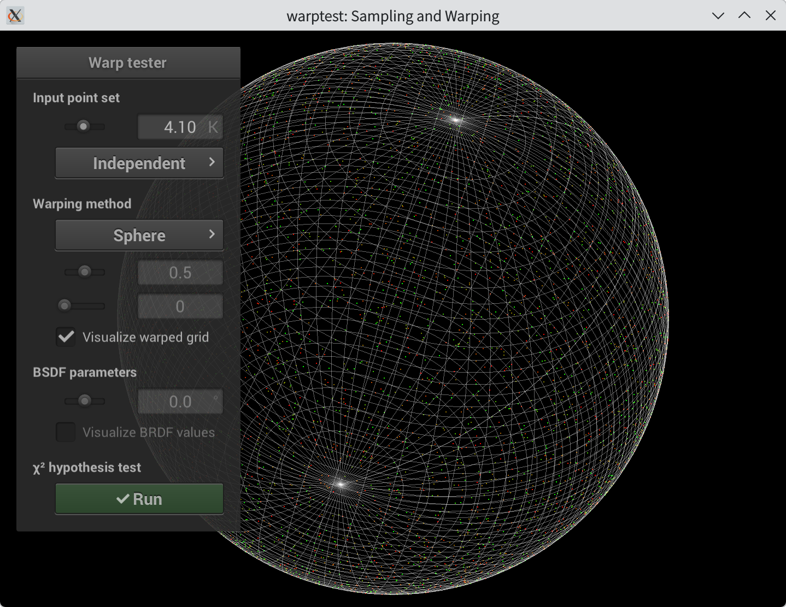
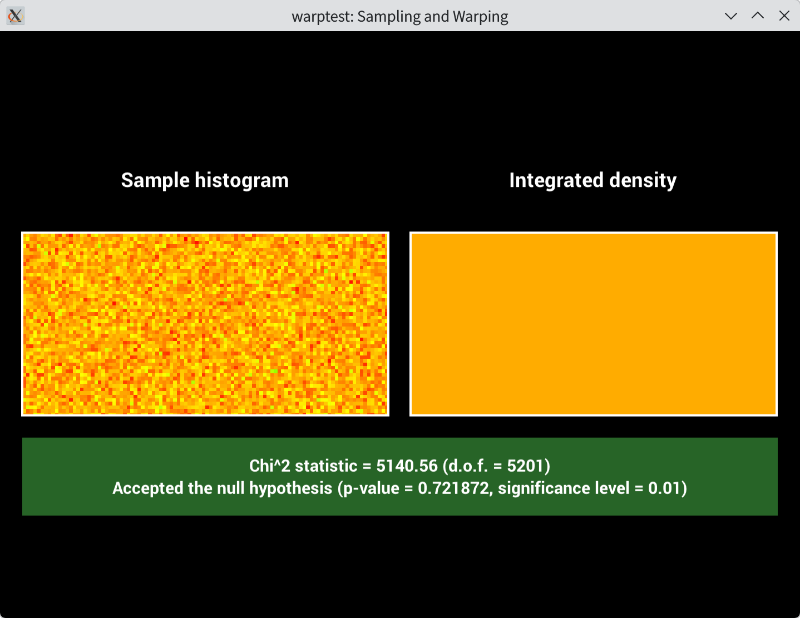

#### `Warp::squareToUniformHemisphere`

半球的 sampling 可以直接拿 sphere 的 sampling 來用。超 trivial 的。

```cpp
Vector3f Warp::squareToUniformHemisphere(const Point2f &sample) {
    auto sphere = Warp::squareToUniformSphere(sample);
    sphere.z() = std::abs(sphere.z());
    return sphere;
}

float Warp::squareToUniformHemispherePdf(const Vector3f &v) {
    if (v.z() < 0) return 0;
    return Warp::squareToUniformSpherePdf(v) * 2;
}
```

執行 `./warptest` 的結果：

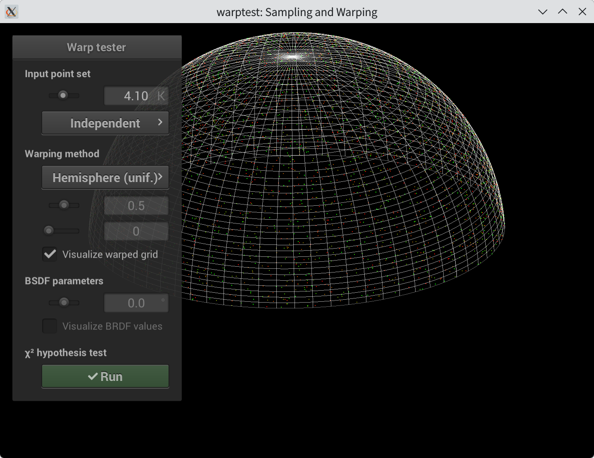
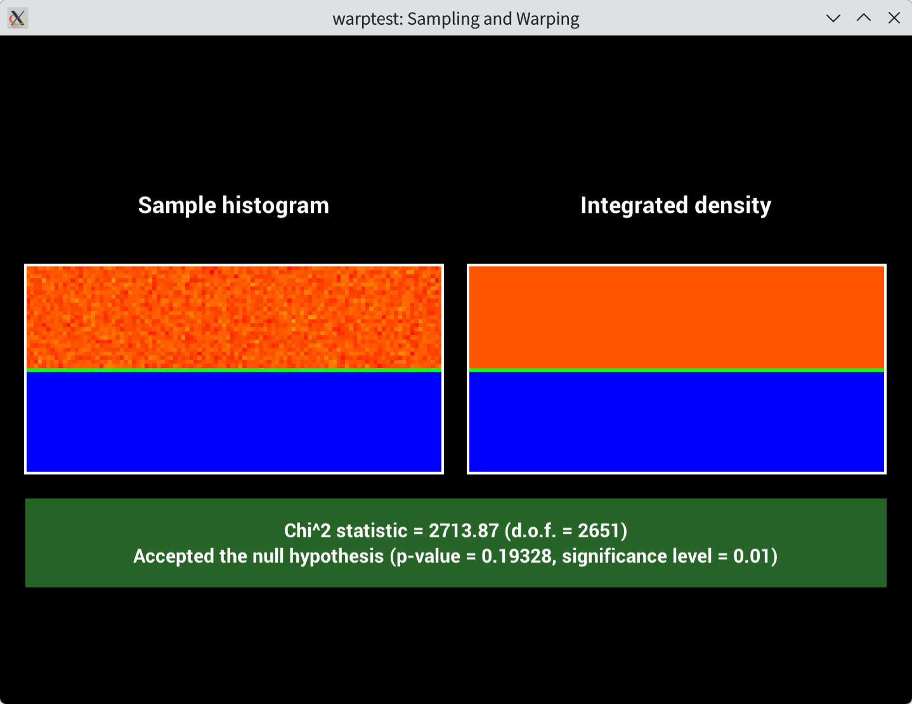

#### `Warp::squareToCosineHemisphere`

##### Derivation

用跟 `squareToUniformSphere` 一樣的推導方式，可以列出

$$
\mathrm{d}x\ \mathrm{d}y = \frac{\cos\theta}{\pi} \cdot \sin{\theta} \cdot \mathrm{d}\theta \cdot \mathrm{d}\phi
$$

省略計算步驟。可以得到 $\phi = 2\pi y, \theta = \frac{1}{2} \cos^{-1}(-2x+1)$。

##### Code

```cpp
Vector3f Warp::squareToCosineHemisphere(const Point2f &sample) {
    float phi = 2 * pi * sample.y();
    float theta = std::acos(-2 * sample.x() + 1) / 2;
    return Vector3f{
        std::sin(theta) * std::cos(phi),
        std::sin(theta) * std::sin(phi),
        std::cos(theta)
    };
}

float Warp::squareToCosineHemispherePdf(const Vector3f &v) {
    float cos_theta = Frame::cosTheta(v);
    if (cos_theta < 0.f) return 0.f;
    return cos_theta / pi;
}
```

執行 `./warptest` 的結果：

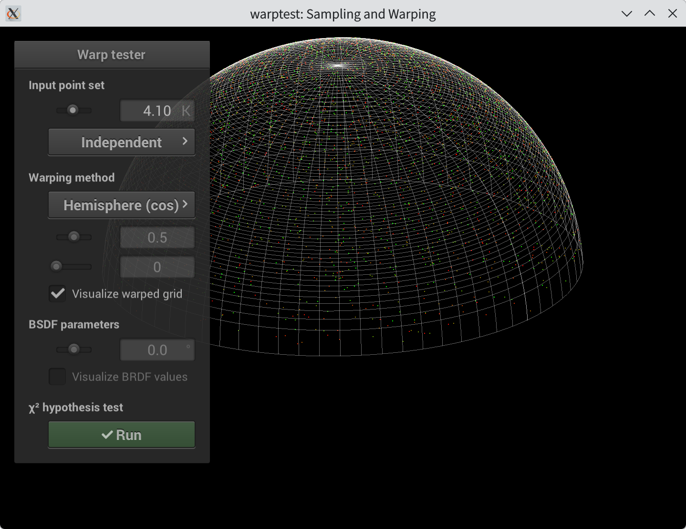
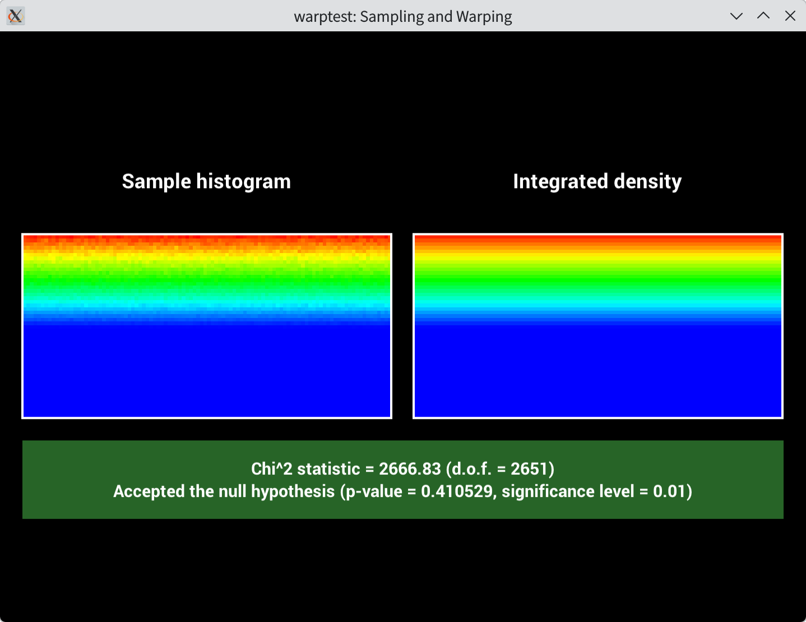

#### `Warp::squareToBeckmann`

這題用題目給的 "recipe" 做。

##### Derivation

The CDF:

$$
\begin{align*}
F(\theta, \phi) &= \int_{0}^{\theta} \int_{0}^{\phi} D(\theta, \phi) \cdot \sin\theta\ \mathrm{d}\phi\ \mathrm{d}\theta \\\\
&= \int_{0}^{\theta} \int_{0}^{\phi} \frac{1}{2\pi} \cdot \frac{2 e^{\frac{-\tan^2\theta}{\alpha^2}}}{\alpha^2 \cos^3\theta} \cdot \sin\theta\ \mathrm{d}\phi\ \mathrm{d}\theta
\end{align*}
$$

Since $\theta$ and $\phi$ are independent, we can split the integral.

$$
\begin{align*}
&= \left( \int_{0}^{\theta} \frac{1}{2\pi} \cdot \frac{2 e^{\frac{-\tan^2\theta}{\alpha^2}}}{\alpha^2 \cos^3\theta} \cdot \sin\theta\ \mathrm{d}\theta \right) \left( \int_{0}^{\phi} \mathrm{d}\phi \right) \\\\
&= \frac{1}{2\pi} \left( \int_{0}^{\theta} \cdot \frac{2 e^{\frac{-\tan^2\theta}{\alpha^2}}}{\alpha^2 \cos^3\theta} \cdot \sin\theta\ \mathrm{d}\theta \right) \cdot \phi
\end{align*}
$$

Note the differential:

$$
\begin{align*}
\frac{\mathrm{d} e^{\frac{-\tan^2\theta}{\alpha^2}}}{\mathrm{d}\theta} &= \frac{\mathrm{d} e^{\frac{-\tan^2\theta}{\alpha^2}}}{\mathrm{d} \frac{-\tan^2\theta}{\alpha^2}} \cdot \frac{\mathrm{d} \frac{-\tan^2\theta}{\alpha^2}}{\mathrm{d} \tan\theta} \cdot \frac{\mathrm{d} \tan\theta}{\mathrm{d} \theta} \\\\
&= e^{\frac{-\tan^2\theta}{\alpha^2}} \cdot - \frac{2}{\alpha^2} \tan\theta \cdot \frac{1}{\cos^2\theta} \\\\
&= - \frac{2 e^{\frac{-\tan^2\theta}{\alpha^2}}}{\alpha^2 \cos^3\theta} \cdot \sin\theta
\end{align*}
$$

So we can further simplify the CDF:

$$
\begin{align*}
&= \frac{1}{2\pi} \cdot \left[ - e^{\frac{-\tan^2\theta}{\alpha^2}} \right]_0^{\theta} \cdot \phi \\\\
&= \frac{1}{2\pi} \cdot \phi \cdot \left(1 - e^{\frac{-\tan^2\theta}{\alpha^2}} \right)
\end{align*}
$$

Since $\theta$ and $\phi$ are independent, the CDF of Beckmann distribution equals the CDF of $\theta$ multiplied by $\phi$. We use $\phi = 2\pi y$ as before, and then the CDF of $\theta$ is $(1 - e^{\frac{-\tan^2\theta}{\alpha^2}})$.

The inverse CDF is

$$
\tan^{-1}(\sqrt{-\alpha^2 \ln (1-u)})\qquad, 0 \le u < 1
$$

##### Code

```cpp
Vector3f Warp::squareToBeckmann(const Point2f &sample, float alpha) {
    float phi = sample.y() * 2 * pi;
    float theta = std::atan(std::sqrt(- alpha * alpha * std::log(1 - sample.x())));
    float sin_theta = std::sin(theta);
    float cos_theta = std::cos(theta);
    float sin_phi = std::sin(phi);
    float cos_phi = std::cos(phi);
    return Vector3f{
        sin_theta * cos_phi,
        sin_theta * sin_phi,
        cos_theta
    };
}

float Warp::squareToBeckmannPdf(const Vector3f &m, float alpha) {
    float tan_theta = Frame::tanTheta(m);
    float cos_theta = Frame::cosTheta(m);
    if (cos_theta <= 0.f) return 0.f;
    return 1 / (2 * pi) * (2 * std::exp(-tan_theta * tan_theta / alpha / alpha) / (alpha * alpha * cos_theta * cos_theta * cos_theta));
}
```

執行 `./warptest` 的結果：

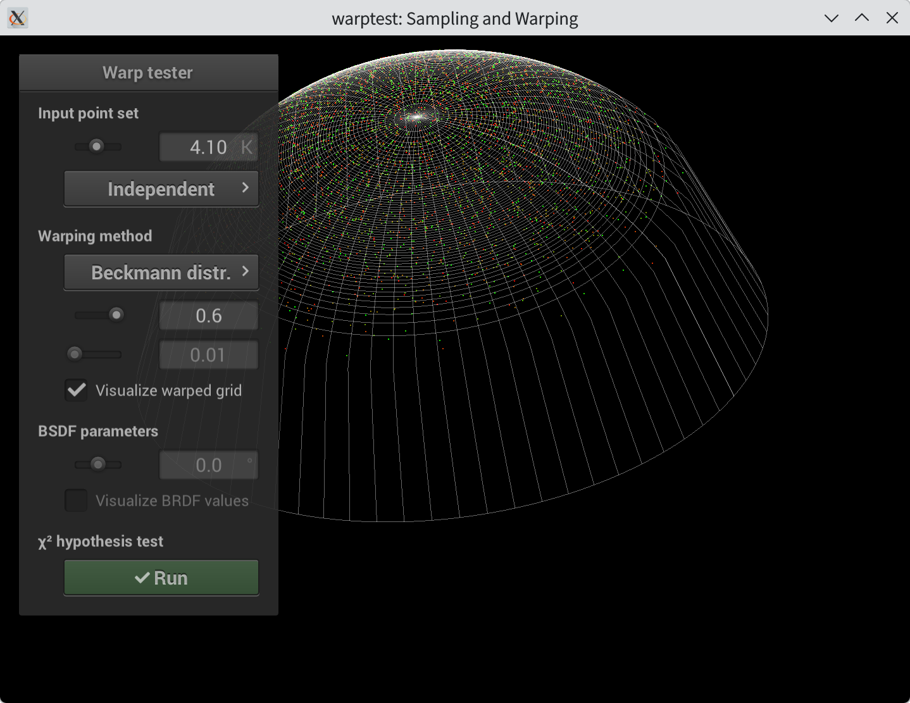
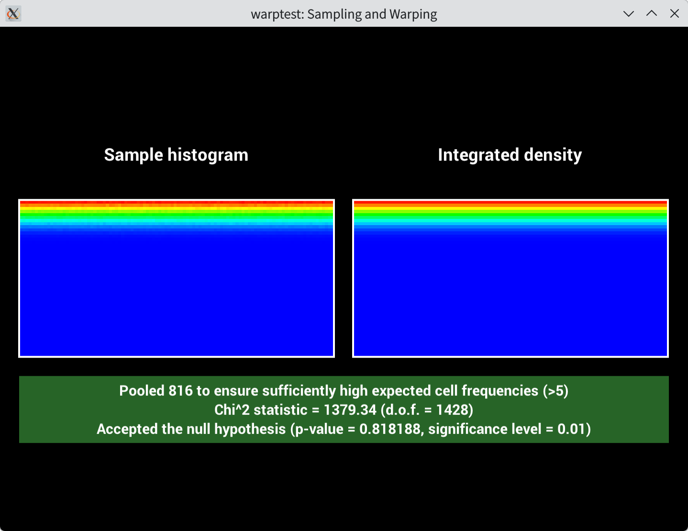

#### 方法比較

在 [`Warp::squareToTent`](#warpsquaretotent) 和 [`Warp::squareToBeckmann`](#warpsquaretobeckmann)，我使用的是課程網站上的標準 "recipe"，也就是：

1. 計算 target distribution 的 CDF
2. 計算 inverse CDF
3. 用 inverse CDF 當 warping function

然而，在 [`Warp::squareToUniformDisk`](#warpsquaretouniformdisk)、[`Warp::squareToUniformSphere`](#warpsquaretouniformsphere)、[`Warp::squareToCosineHemisphere`](#warpsquaretocosinehemisphere)，我用的是另一種自己想的方法：

1. 計算 source distribution 的 PDF 和 infinitesimal area element
2. 計算 target distribution 的 PDF 和 infinitesimal area element
3. 把轉換前後的 infinitesimal probability 寫成等式，解轉換的關係式

其實仔細觀察，會發現兩者的解法很相似，差別在標準 recipe 是積分（解 CDF），而我的作法是微分。

以 `squareToUniformSphere` 為例，我的作法會列出這個等式：

$$
\mathrm{d}x\ \mathrm{d}y = \frac{1}{4\pi} \cdot \sin\theta \cdot \mathrm{d}\theta \cdot \mathrm{d}\phi
$$

用標準 recipe 則會列出這個 CDF：

$$
\int_0^\theta \int_0^\phi \frac{1}{4\pi} \cdot \sin\theta\ \mathrm{d}\phi\ \mathrm{d}\theta
$$

觀點不同，但解的東西其實一模一樣，最後都會得出 $x = \frac{1}{2}(1-\cos\theta)$ 這個關係式。

### 後記

微積分好玄妙，AI 好方便。如果是在沒有 AI 的時代，我大概要去巴著數學很好的朋友請他們幫我搞懂很多我現在已經無法再次搞懂的概念，或者我可能直接放棄這個作業。但如果放棄的話，現在至少也還有 AI 可以先產個正確的答案，讓我可以繼續進行後面的作業，但在沒有 AI 的時代的話可能真的每份作業都是 single point of failure。總之，且用且珍惜，並且得好好思考自己的價值是什麼。

Assignment 2 的後半段要寫 simple rendering function，應該就下一篇文章再繼續。
