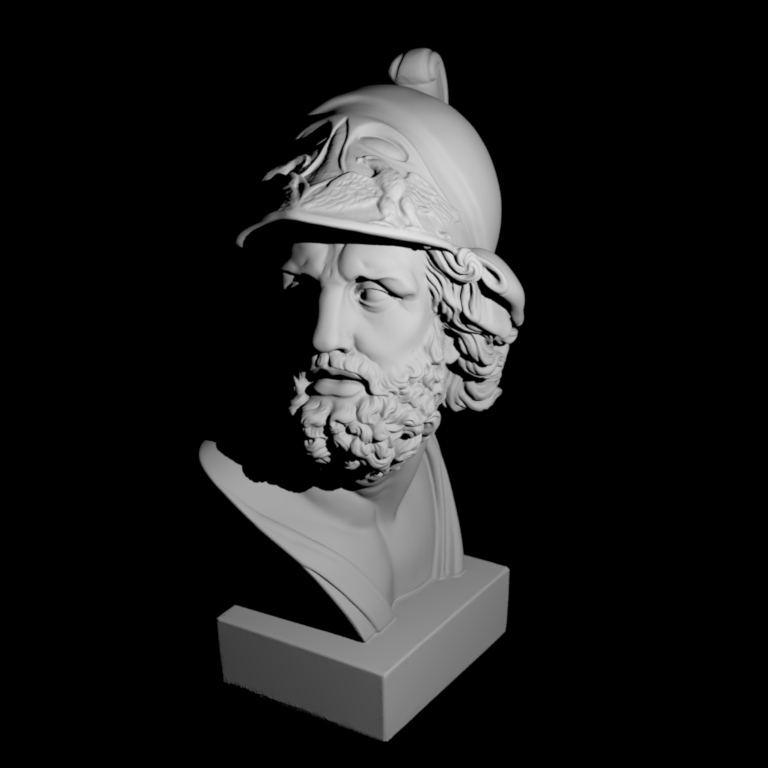
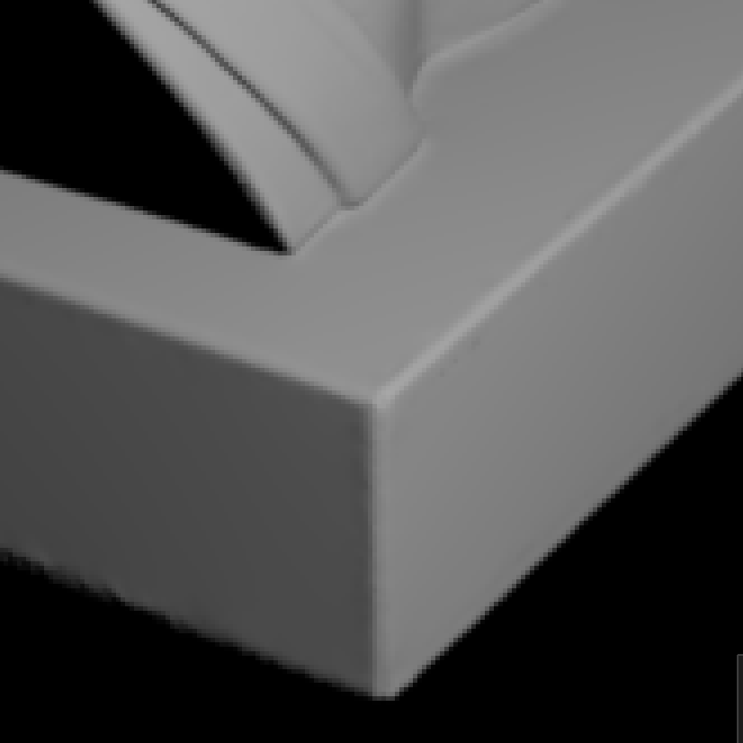
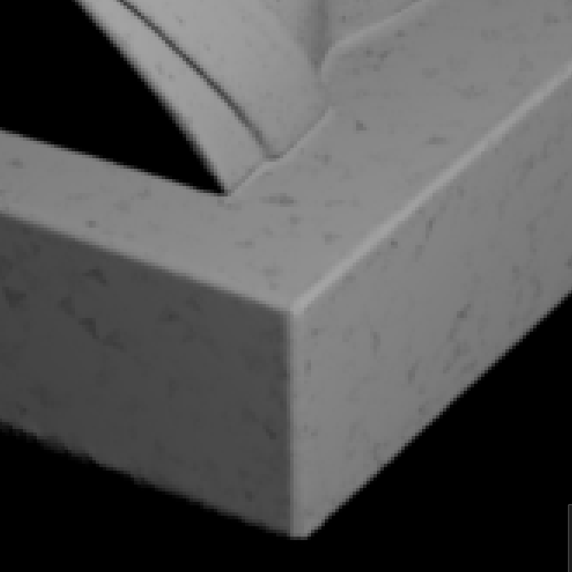
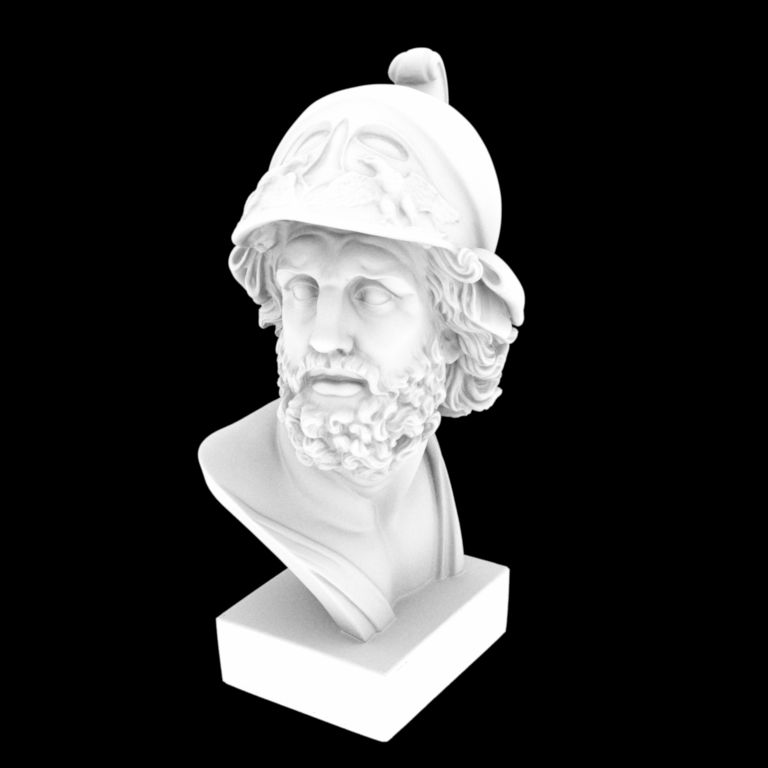

## Assignment 2: Monte Carlo Sampling and Ambient Occlusion

### Part 2: Two Simple Rendering Algorithms

作業 2 的後半部很明顯感受到比前一篇 [warping function](../20260530-nori-2/) 還要簡單，畢竟這邊只要寫 code 就好，之前是一堆微積分跟機率。

#### Part 2.1 Point Lights

總之就是把題目敘述給的公式寫成程式碼。

值得注意的幾個部份，第一個是 $\cos\theta$ 的計算，可以使用 `Frame::cosTheta()` 和 `Frame::toLocal()` 來方便求得。第二個是題目敘述有提到的用 shadow ray query 來計算 visibility。

記錄一下踩到的雷。`Ray3f` 這個 class，我原先以為他只有 ray origin 跟 ray direction，結果後來才發現他有 `mint` 跟 `maxt` 兩個參數來決定 ray 的延伸區段。可以在 `include/nori/ray.h` 裡面看到 `struct TRay` 的 constructor。要用 shadow ray query 的話，`mint` 不能設定成 0，否則若起始點有 mesh，就有可能因為浮點數誤差而讓 ray 跟起始點的 mesh 相交；而 `maxt` 也不能單純設光源到物體的距離，原理相同。兩者都要有一個 epsilon 的誤差。

```cpp
    Color3f Li(const Scene *scene, Sampler *sampler, const Ray3f &ray) const {
        // find if the ray intersects with the scene
        Intersection its;
        if (!scene->rayIntersect(ray, its))
            return Color3f(0.0f);

        float cos_theta = Frame::cosTheta(its.shFrame.toLocal(light_position - its.p).normalized());
        float distance2 = (its.p - light_position).squaredNorm();

        // use shadow ray query to obtain visibility
        Vector3f direction = its.p - light_position;
        float eps = 1e-3; // the smaller the eps, the more noise caused by self-intersection in the output image
        Ray3f shadow_ray{Point3f{light_position}, direction.normalized(), eps, direction.norm() - eps};
        float visibility = (scene->rayIntersect(shadow_ray)) ? 0.f : 1.f;

        return energy / (4 * pi * pi) * std::max(0.f, cos_theta) / distance2 * visibility;
    }
```

<figure>
  
  <figcaption><code>ajax-simple.xml</code> 畫出來的圖，與題目提供的 reference image 看起來相同。</figcaption>
</figure>

實驗一下不同的 `eps` 值，會發現如果設定太小（例如 `1e-5`）的話，會有一些黑色斑點，推測是浮點數誤差造成 `rayIntersect` 誤判。可以用下圖來比較。

<figure>
  <div style="display: flex; gap: 20px;">
    <div>
      
      <p style="text-align: center; font-size: 0.9em;">eps = 1e-3</p>
    </div>
    <div>
      
      <p style="text-align: center; font-size: 0.9em;">eps = 1e-5</p>
    </div>
  </div>
  <figcaption><code>ajax-simple.xml</code> 的結果比較，不同 eps 值的影響。</figcaption>
</figure>

#### Part 2.2 Ambient Occlusion

一樣，把公式寫成 code 即可。

值得注意的是，`Ray3f` 如果不提供 `mint` 跟 `maxt` 的話，預設的值會是 epsilon 跟 infinity（見 `include/nori/ray.h`）。題目敘述中提到，我們可以把 $\alpha$ 設成 $\infty$，把 ambient occlusion 當成 global effect，因此使用 `Ray3f` constructor 預設的 `mint` 跟 `maxt` 即可。

```cpp
    Color3f Li(const Scene *scene, Sampler *sampler, const Ray3f &ray) const {
        // find if the ray intersects with the scene
        Intersection its;
        if (!scene->rayIntersect(ray, its))
            return Color3f(0.0f);

        // use cosine weighted hemisphere sampling
        Vector3f direction = Warp::squareToCosineHemisphere(sampler->next2D());

        // use shadow ray query to obtain visibility
        Ray3f shadow_ray{its.p, its.shFrame.toWorld(direction)}; // (mint, maxt) = (eps, inf)
        return scene->rayIntersect(shadow_ray) ? 0.f : 1.f;
    }
```

在我的電腦上，`./nori ajax-ao.xml` 要跑 17 秒。

<figure>
  
  <figcaption><code>ajax-ao.xml</code> 畫出來的圖，與題目提供的 reference image 看起來相同。</figcaption>
</figure>

<details>
	<summary>錯誤嘗試（已折疊）</summary>

其實我原本寫的版本是自己在 `Li()` 裡面模擬積分，類似下方程式碼這樣，但這樣執行到天荒地老都跑不完。

```cpp
    Color3f Li(const Scene *scene, Sampler *sampler, const Ray3f &ray) const {
        ...

        // simulate the integral
        Color3f ret{0.f};
        constexpr int num_sample = 1e3;
        for (int i = 0; i < num_sample; ++i) {
            // use cosine weighted hemisphere sampling
            Vector3f direction = Warp::squareToCosineHemisphere(Point2f{sampler->next2D()});

            // use shadow ray query to obtain visibility
            Ray3f shadow_ray{its.p, its.shFrame.toWorld(direction)}; // (mint, maxt) = (eps, inf)
            if (!scene->rayIntersect(shadow_ray)) {
                ret += 1.f;
            }
        }
        return ret / num_sample;
    }
```

後來發現，在 `src/main.cpp` 裡的 `renderBlock()` 中，可以看到對於每個 pixel，都會呼叫 `sampler->getSampleCount()` 次 `integrator->Li()`。也就是說，Monte Carlo averaging 已經發生在這邊了，我們不需要在 integrator 裡自己做積分的模擬。

```cpp
    /* For each pixel and pixel sample sample */
    for (int y=0; y<size.y(); ++y) {
        for (int x=0; x<size.x(); ++x) {
            for (uint32_t i=0; i<sampler->getSampleCount(); ++i) {
                Point2f pixelSample = Point2f((float) (x + offset.x()), (float) (y + offset.y())) + sampler->next2D();
                Point2f apertureSample = sampler->next2D();

                /* Sample a ray from the camera */
                Ray3f ray;
                Color3f value = camera->sampleRay(ray, pixelSample, apertureSample);

                /* Compute the incident radiance */
                value *= integrator->Li(scene, sampler, ray);

                /* Store in the image block */
                block.put(pixelSample, value);
            }
        }
    }
```

</details>

### 後記

完成了 Assignment 2 了，很有趣。雖然機率跟微積分的數學有點令人力不從心，但還是感覺學到很多。電腦圖學最吸引我的地方，就是這樣把物理世界的公式，用非常漂亮的數學跟程式來表達和演算出來。看著自己的程式最終產生了想像中的圖，實在非常有成就感。

繼續往 Assignment 3 前進。
